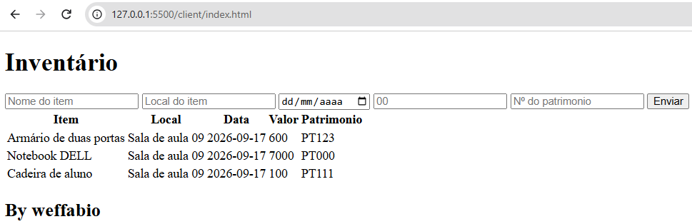

# Inventário Backend
Aula de backend MVC projeto de exemplo usando um mockup bens.json

## Tecnologias
- Node.js
- Express
- Cors
- MVC
- VsCode
- JavaScript
## Passos para testar
- 1 Clone este repositório
- 2 Abra com Vscode e em um terminal digite:
```bash
npm install
npm run dev
```
= 3 Abra o arquivo `client/index.html` com Live Server do VsCode

## Screenshot
